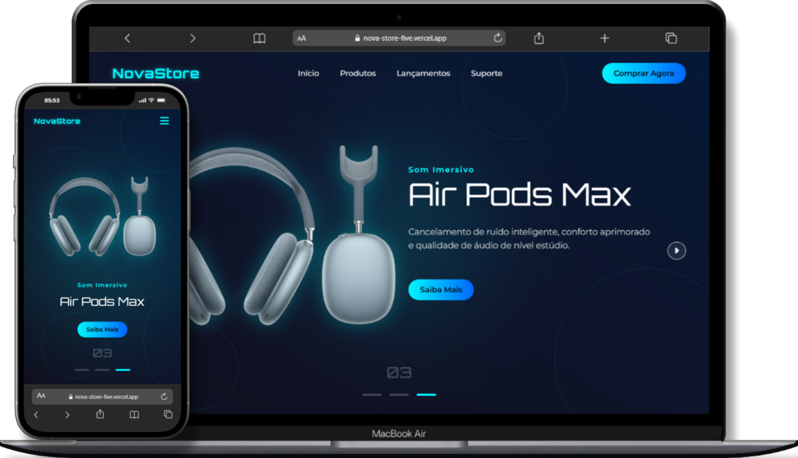

# 🎧 NovaStore – Landing Page

A **NovaStore** é uma landing page moderna inspirada no estilo visual da Apple, desenvolvida com **HTML, CSS e JavaScript**.  
O projeto apresenta um **carrossel animado de produtos** (Apple Watch, Vision Pro e AirPods Max), transições suaves, efeito **glassmorphism**, animações responsivas e um menu mobile elegante.

Projetado com foco em **experiência do usuário**, **responsividade** e **design premium**.

---

## 🔗 Acesse o site

👉 **Link do projeto:** 
https://nova-store-five.vercel.app/

---

## 🚀 Tecnologias Utilizadas

- **HTML5**
- **CSS3**
- **JavaScript Vanilla**
- **Font Awesome** (ícones)
- **Google Fonts**

---

## 📸 Preview



## 📁 Estrutura de Pastas

```
/
/src
│
├── /images
│ ├── apple-watch.png
│ ├── air-pods.png
│ └── vision-pro.png
│
├── /js
│ └── script.js
│
└── /css
└── style.css
index.html
README.md
LICENSE
```

---

## 🧠 Funcionalidades

- 🎞 **Carrossel animado** com transição suave  
- 🔁 **Autoplay inteligente** com reinício automático  
- ✨ **Animações de entrada** em textos e imagens  
- 🔳 **Botões de navegação com efeito glass**  
- 🌌 **Fundo decorativo animado (bg-decor)** no desktop  
- 📱 **Responsivo (Mobile → Desktop)**  
- 🍔 **Menu mobile com animação de abertura/fechamento**  
- ⚪ **Indicadores de slides (dots + numeração)**  
- 🧱 **Código organizado em BEM** (block, element, modifier)

---

## 📦 Como usar

1. Clone o repositório:

   ```bash
   git clone https://github.com/Carlos728293/landing-page-nova-store.git
   ```

2. Navegue até o diretório:

   ```bash
   cd landing-page-nova-store
   ```

3. Abra o arquivo `index.html` no navegador:
   - Pode usar uma extensão como "Live Server" no VSCode.
   - Ou simplesmente clique duas vezes no arquivo.

## 📝 Licença

Este projeto está sob a licença MIT. Sinta-se livre para utilizar, modificar e compartilhar!

---

### 💙 Criado com criatividade, estilo e animações elegantes
